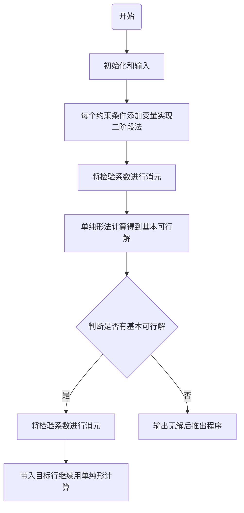
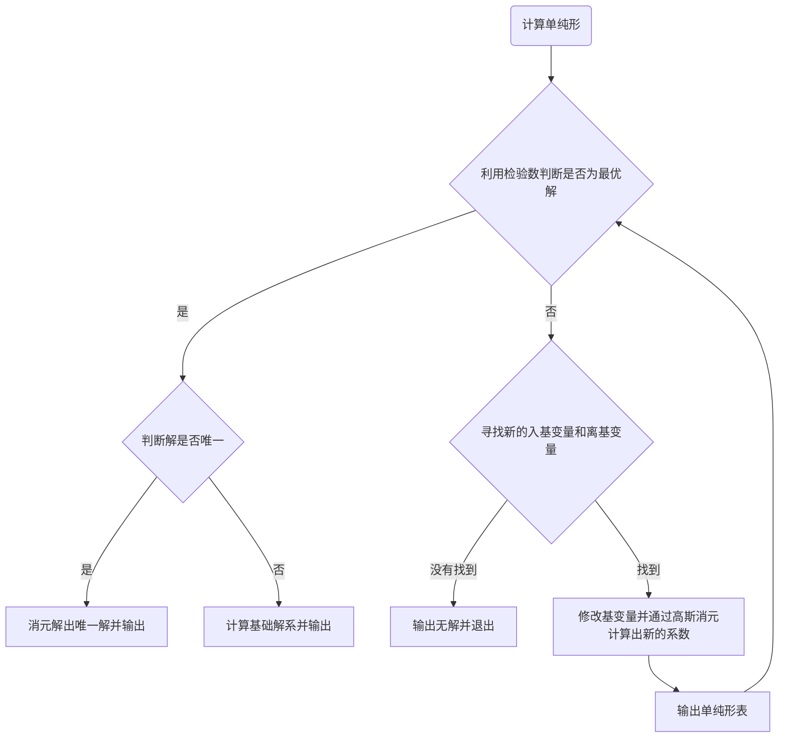

# 单纯形

## 算法流程图




## 如何使用

### 输入格式

输入文件 `input.txt` 第一行必须包含

将可执行文件与 `input.txt` 放在同一文件夹下，并运行可执行文件，会生成一个 `output.txt` 文件，计算单纯形的过程和结果会输出在其中。

## 有待实现的

优化输入格式为
```
n
a[1][1]*x1+a[1][2]*x2+...+a[1][n]*xn<=b[1]
...
.
.
```
其中 `a[1][1],b[1]` 等数可以以分数 `a/b` 或小数 `a.b` 的形式输入。

`x1` 等变量可以自定义变量名（以大小写字母或下划线开头，仅能包含大小写字母、下划线和数字），但是有一些变量名为**关键词**不能使用，如 add+数字 等。

输入可以为等式或不等式（`=`,`<=`,`>=`）会通过添加变量转化为标准型。

目前仅支持计算出线性规划的最优解，不支持输出最优解的取等条件。当解唯一时输出最优解，当解不唯一时输出最优解的线性表示。

目前只有 $\mathcal{D}antzig$ 规则的迭代方式，也只有以分数存储的方式。在计算过程中可能会陷入循环或者分数过大而导致错误。可能会加入大 $M$ 法、字典序法等迭代方式和小数模式等。
