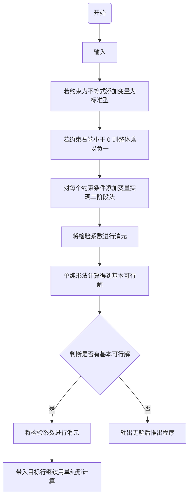
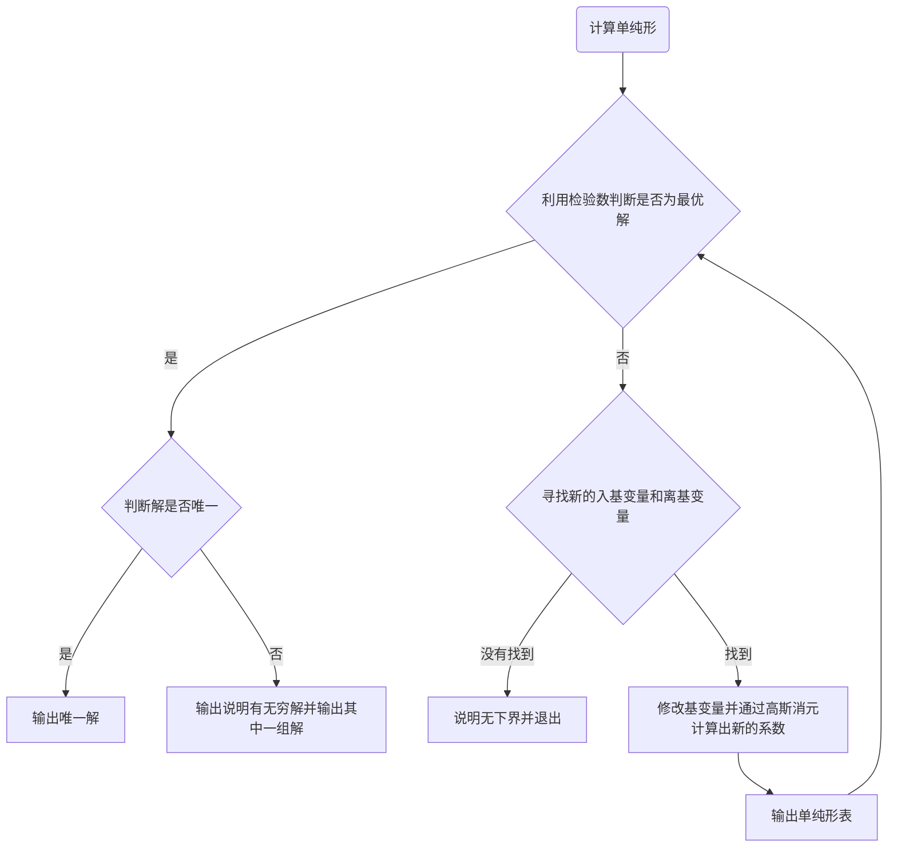

# 单纯形

## 算法流程图




## 变量说明

与求解单纯形相关变量有以下：
```
int m;//约束行个数
int n;//变量个数
string z;//最小化函数的名称
vector<string>nam;//编号为 i 的变量的名称
vector<int>base;//第 i 行约束行的基变量
vector<vector<Number>>a;//单纯形表
vector<Number>b;//单纯形表右端列的值
```

## 如何使用

### 环境配置

运行前需要确保电脑上已经有 g++ 环境。若没有环境可以在 [Windows 版本下载链接](https://github.com/niXman/mingw-builds-binaries/releases/download/14.2.0-rt_v12-rev0/x86_64-14.2.0-release-posix-seh-ucrt-rt_v12-rev0.7z)，其他系统请在 [下载链接](https://github.com/niXman/mingw-builds-binaries/releases) 中选择合适版本下载并添加环境变量后运行。

### 输入与输出

输入文件 `input.txt` 第一行必须包含一个整数 $n$

接下来 $n$ 行为 $n$ 个约束条件，每一行的格式格式均为

```
a1*x1+a2*x2+...+am*xm=b
```

其中 `a1,a2,...,am,b` 可以用分数 `a/b` 或者小数 `a.b` 输入，`*` 可以省略，`+` 也可以替换为减号，`x1,x2,...,xm` 为变量名，格式为以下划线或大小写字母开头，仅包含下划线，大小写字母和数字构成的字符串，且不要使用 `y`+ 数字和 `add`+ 数字，`=` 可以换成 `<=` 和 `>=`。

接下来一行为需要最小化的函数，输入格式为

```
a1*x1+a2*x2+...+am*xm
```

具体限制同上

再接下来的一行为单纯形的迭代规则，目前支支持 `Dantzig` 规则和 `Bland` 规则。

以下给出一个正确输入的例子：
```
3
x1+4.5/3.000xxx_2+0.5*xxx_2<=5
-x1 -x3 <= -3
2/1*x1 - 233/233xxx_2+x3=2
-2.0*x1 + xxx_2
Dantzig
```

输入后，将 `run.bat` 与 `input.txt` 放在同一文件夹下，并运行 `run.bat`，会生成一个 `output.txt` 文件，计算单纯形的过程和结果会输出在其中。

入上例子在 `output.txt` 中的输出为：
```
    |x1|x3|xxx_2|y0|y1|add1|add2|add3|RHS
----+--+--+-----+--+--+----+----+----+---
add1|1 |0 |2    |1 |0 |1   |0   |0   |5
----+--+--+-----+--+--+----+----+----+---
add2|1 |1 |0    |0 |-1|0   |1   |0   |3
----+--+--+-----+--+--+----+----+----+---
add3|2 |1 |-1   |0 |0 |0   |0   |1   |2
----+--+--+-----+--+--+----+----+----+---
g   |0 |0 |0    |0 |0 |-1  |-1  |-1  |0

    |x1|x3|xxx_2|y0|y1|add1|add2|add3|RHS
----+--+--+-----+--+--+----+----+----+---
add1|1 |0 |2    |1 |0 |1   |0   |0   |5
----+--+--+-----+--+--+----+----+----+---
add2|1 |1 |0    |0 |-1|0   |1   |0   |3
----+--+--+-----+--+--+----+----+----+---
add3|2 |1 |-1   |0 |0 |0   |0   |1   |2
----+--+--+-----+--+--+----+----+----+---
g   |4 |2 |1    |1 |-1|0   |0   |0   |10

add1->xxx_2
    |x1|x3  |xxx_2|y0|y1|add1|add2|add3|RHS
----+--+----+-----+--+--+----+----+----+---
add1|0 |-1/2|5/2  |1 |0 |1   |0   |-1/2|4
----+--+----+-----+--+--+----+----+----+---
add2|0 |1/2 |1/2  |0 |-1|0   |1   |-1/2|2
----+--+----+-----+--+--+----+----+----+---
x1  |1 |1/2 |-1/2 |0 |0 |0   |0   |1/2 |1
----+--+----+-----+--+--+----+----+----+---
g   |0 |0   |3    |1 |-1|0   |0   |-2  |6

x1->x1
     |x1|x3  |xxx_2|y0  |y1|add1|add2|add3|RHS
-----+--+----+-----+----+--+----+----+----+---
xxx_2|0 |-1/5|1    |2/5 |0 |2/5 |0   |-1/5|8/5
-----+--+----+-----+----+--+----+----+----+---
add2 |0 |3/5 |0    |-1/5|-1|-1/5|1   |-2/5|6/5
-----+--+----+-----+----+--+----+----+----+---
x1   |1 |2/5 |0    |1/5 |0 |1/5 |0   |2/5 |9/5
-----+--+----+-----+----+--+----+----+----+---
g    |0 |3/5 |0    |-1/5|-1|-6/5|0   |-7/5|6/5

add2->x3
     |x1|x3|xxx_2|y0  |y1  |add1|add2|add3|RHS
-----+--+--+-----+----+----+----+----+----+---
xxx_2|0 |0 |1    |1/3 |-1/3|1/3 |1/3 |-1/3|2
-----+--+--+-----+----+----+----+----+----+---
x3   |0 |1 |0    |-1/3|-5/3|-1/3|5/3 |-2/3|2
-----+--+--+-----+----+----+----+----+----+---
x1   |1 |0 |0    |1/3 |2/3 |1/3 |-2/3|2/3 |1
-----+--+--+-----+----+----+----+----+----+---
g    |0 |0 |0    |0   |0   |-1  |-1  |-1  |0

min:0
x1=1
x3=2
xxx_2=2
y0=0
y1=0
add1=0
add2=0
add3=0
     |x1|x3|xxx_2|y0  |y1  |RHS
-----+--+--+-----+----+----+---
xxx_2|0 |0 |1    |1/3 |-1/3|2
-----+--+--+-----+----+----+---
x3   |0 |1 |0    |-1/3|-5/3|2
-----+--+--+-----+----+----+---
x1   |1 |0 |0    |1/3 |2/3 |1
-----+--+--+-----+----+----+---
z    |0 |0 |0    |-1/3|-5/3|0

min:0
x1=1
x3=2
xxx_2=2
y0=0
y1=0
```

即最后得到当 $x_1=1,x_3=2,xxx_2=2,y_0=0,y_1=0$  时取得最小值 $\min -2x_1+xxx_2=0$。

更多的输入输出例子在 `Examples` 文件夹中（输入均来自课本习题，且均与答案相同）。

## 有待实现的

当解不唯一时输出最优解的线性表示。（解空间为一个凸集，可能不存在多项式个数内的线性表示）
